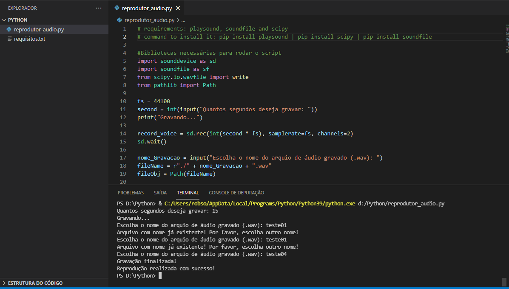

# Record_and_play_audios

Criador: Francisco Robson de O. Dutra Filho 
Repositório criado no dia 04/09/2021 
Instagram: @robsondutra_  

<h2>Sobre</h2>
Gravador e reprodutor de áudios feito em Python. O objetivo deste programa é você gravar um áudio por X segundos que você informar e, logo após, ser reproduzido ainda no mesmo ciclo de execução do programa (você, também, vai poder nomear o arquivo de áudio a ser salvo).

<h2>Foto ilustrativa</h2>

